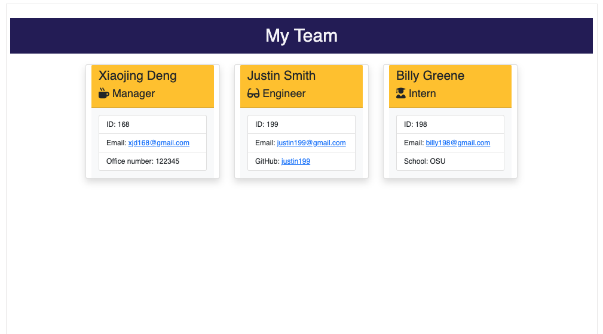

<h1>Team Profile Generator👋</h1>

## Badges

<br> 

<br>

<br>

<br>

<br>


## Description
🔍 This application was created to generate a high-quality, professional Team Profile depending on a series of questions a user answers in their command line using Node.js. The team-profile.html file is created in the dist directory and can be found [here](./dist/team-profile.html).In the brower, It is a nicely formatted team roster based on user input. When you click on an email address, then your default email program opens and populates the TO field fo the email with the address. When you click on the GitHub username, Then that GitHub profile opens in a new tab.


## Table of Contents
- [Description](#description)
- [Installation](#installation)
- [Usage](#usage)
- [Screenshot](#screenshot)
- [Contributing](#contributing)
- [License](#license)
- [Questions](#questions)


## Installation
💾 <br/>```
npm init ```
<br/>```
npm install inquirer ```

     


## usage
💻 Run the following command in the command line and answer the prompted questions about you project: <br/> ```
node index.js ```
<br/>
Download video, click [here](./dist/team-profile-generator-1.mp4)


https://user-images.githubusercontent.com/110792983/198071177-279bda83-b1d7-4cdc-83ed-c7933b9ee220.mp4


## Screenshot


## Contributing
👥 Xiaojing Deng


## License

</br>
<p>Permission to use this application is granted under the MIT license.</p>
 
[MIT](https://choosealicense.com/licenses/mit)


## Tests
``` npm run test ```

## Questions
✋Reach me here:<br/>
:octocat: Find me on GitHub: [xiaojing168jmg168](https://github.com/xiaojing168jmg168)<br/>
📩 Email me with any questions: 8redfishcreative@gmail.com


*This README was generated by* [README-generator](https://github.com/xiaojing168jmg168/readme-generator)
